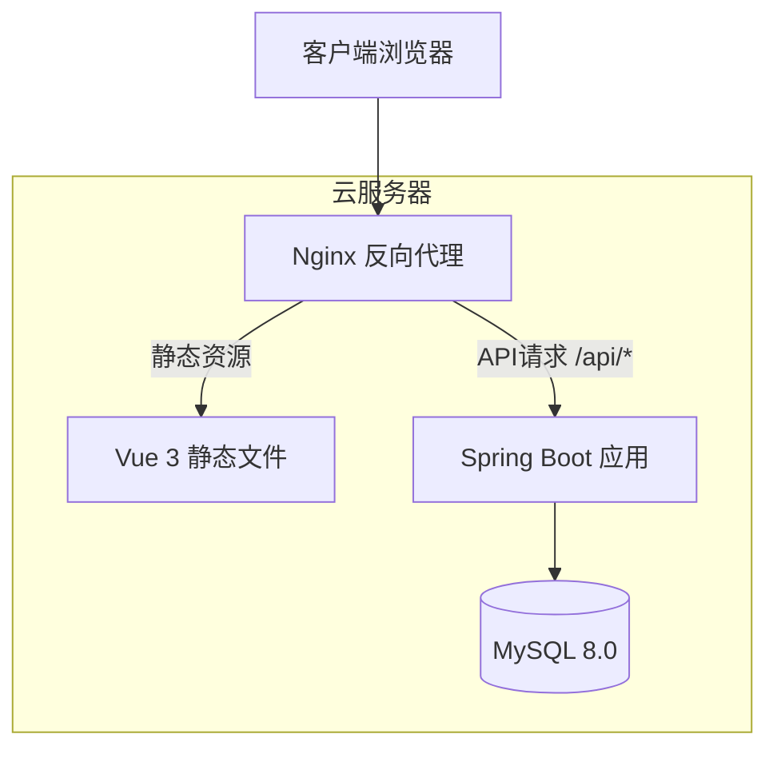
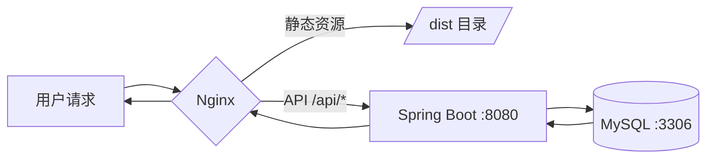

## 产品概述

AimLab 射击训练系统云服务器部署方案，为现有的 Spring Boot + Vue 3 + MySQL 技术栈应用提供完整的生产环境部署解决方案，支持小型规模（<100并发）的单机部署架构。

## 核心功能

- **前端部署**：Vue 3 应用构建与静态资源托管
- **后端部署**：Spring Boot 应用的 JAR 包部署与服务管理
- **数据库配置**：MySQL 8.0 安装、安全配置与数据初始化
- **Nginx 反向代理**：统一入口、负载均衡、静态资源服务
- **SSL 证书配置**：HTTPS 安全访问、证书自动续期
- **环境变量管理**：多环境配置隔离、敏感信息安全存储
- **自动化部署**：CI/CD 流水线、一键部署脚本
- **运维监控**：日志管理、健康检查、基础监控

## 技术栈

- **后端框架**：Spring Boot 2.7.18 (Java 11+)
- **前端框架**：Vue 3 + Vite
- **数据库**：MySQL 8.0
- **Web服务器**：Nginx 1.24+
- **进程管理**：Systemd
- **SSL证书**：Let's Encrypt + Certbot
- **CI/CD**：GitHub Actions / Shell Scripts

## 架构设计

### 系统架构

采用经典的三层单机部署架构，通过 Nginx 作为统一入口处理所有请求。



### 模块划分

| 模块 | 职责 | 技术组件 | 端口 |
| --- | --- | --- | --- |
| Web层 | 反向代理、SSL终止、静态资源 | Nginx | 80/443 |
| 应用层 | 业务逻辑处理 | Spring Boot | 8080 |
| 数据层 | 数据持久化 | MySQL | 3306 |


### 数据流



## 实现细节

### 核心目录结构

```
/opt/aimlab/
├── frontend/                # 前端静态资源
│   └── dist/               # Vue 构建产物
├── backend/                 # 后端应用
│   ├── aimlab.jar          # Spring Boot JAR
│   ├── config/             # 外部配置
│   │   └── application-prod.yml
│   └── logs/               # 应用日志
├── scripts/                 # 部署脚本
│   ├── deploy.sh           # 一键部署
│   ├── backup.sh           # 数据库备份
│   └── health-check.sh     # 健康检查
├── nginx/                   # Nginx 配置
│   └── aimlab.conf
└── .env                     # 环境变量
```

### Nginx 配置结构

```
server {
    listen 443 ssl http2;
    server_name your-domain.com;
    
    ssl_certificate /etc/letsencrypt/live/your-domain.com/fullchain.pem;
    ssl_certificate_key /etc/letsencrypt/live/your-domain.com/privkey.pem;
    
    # 前端静态资源
    location / {
        root /opt/aimlab/frontend/dist;
        try_files $uri $uri/ /index.html;
    }
    
    # API 反向代理
    location /api/ {
        proxy_pass http://127.0.0.1:8080;
        proxy_set_header Host $host;
        proxy_set_header X-Real-IP $remote_addr;
    }
}
```

### Systemd 服务配置

```
[Unit]
Description=AimLab Spring Boot Application
After=network.target mysql.service

[Service]
Type=simple
User=aimlab
WorkingDirectory=/opt/aimlab/backend
ExecStart=/usr/bin/java -jar -Dspring.profiles.active=prod aimlab.jar
Restart=always
RestartSec=10

[Install]
WantedBy=multi-user.target
```

### 环境变量管理

```
# /opt/aimlab/.env
DB_HOST=127.0.0.1
DB_PORT=3306
DB_NAME=aimlab
DB_USER=aimlab_user
DB_PASSWORD=<secure_password>
JWT_SECRET=<random_secret>
```

## 技术考量

### 安全措施

- MySQL 仅监听 127.0.0.1，禁止远程访问
- 使用非 root 用户运行应用（账户：root 密码：Xuyouxin7844!)
- 敏感配置通过环境变量注入
- SSL/TLS 加密所有外部通信
- 配置防火墙仅开放 80/443 端口

### 性能优化

- Nginx 开启 gzip 压缩
- 静态资源设置长期缓存
- MySQL 连接池配置优化
- JVM 内存参数调优

### 备份策略

- MySQL 每日自动备份
- 备份文件保留 7 天
- 支持手动触发备份

## Agent Extensions

### SubAgent

- **code-explorer**
- 用途：探索现有 AimLab 项目结构，了解前后端配置文件、构建脚本、数据库配置等
- 预期结果：获取项目的 pom.xml、application.yml、vite.config.js、数据库脚本等关键配置信息，为部署方案提供准确依据