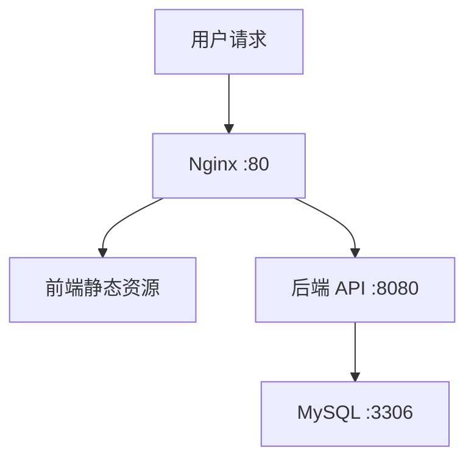

## 产品概述

AimLab 射击训练系统一键部署方案，为 Spring Boot + Vue 3 + MySQL 技术栈的应用提供自动化部署脚本，实现一条命令完成前后端构建和部署到云服务器的完整流程。

## 核心功能

- 一键部署脚本：单条命令完成前端构建、后端打包、服务部署全流程
- 环境自动检测：自动检查 Java、Node.js、MySQL 等依赖环境
- 服务管理：支持启动、停止、重启、状态查看等操作
- 配置管理：集中管理数据库连接、端口配置等参数
- 日志管理：统一的日志输出和错误追踪

## 技术栈

- 部署脚本：Bash Shell Script
- 前端构建：Node.js + npm/pnpm
- 后端构建：Maven
- 进程管理：systemd 或 nohup
- 反向代理：Nginx

## 架构设计

### 系统架构

采用单机部署架构，Nginx 作为反向代理统一入口，前端静态资源由 Nginx 直接托管，后端 API 请求转发至 Spring Boot 服务。



### 部署流程


## 实现细节

### 目录结构

```
deploy/
├── deploy.sh           # 主部署脚本
├── config.sh           # 配置文件
├── nginx.conf          # Nginx 配置模板
└── aimlab.service      # systemd 服务文件
```

### 配置文件设计

```
# config.sh
APP_NAME="aimlab"
DEPLOY_DIR="/opt/aimlab"
FRONTEND_DIR="frontend"
BACKEND_DIR="backend"
JAVA_OPTS="-Xms512m -Xmx1024m"
DB_HOST="localhost"
DB_PORT="3306"
DB_NAME="aimlab"
```

### 脚本功能模块

- **环境检查模块**：验证 Java 17+、Node.js 16+、MySQL 8.0+ 是否安装
- **构建模块**：执行前端 npm build 和后端 mvn package
- **部署模块**：复制构建产物到目标目录
- **服务管理模块**：通过 systemd 管理后端服务生命周期
- **Nginx 配置模块**：自动生成并应用 Nginx 配置

## Agent Extensions

### SubAgent

- **code-explorer**
- 用途：探索现有项目结构，了解前后端目录布局、构建配置和依赖关系
- 预期结果：获取项目的完整结构信息，确保部署脚本与实际项目匹配