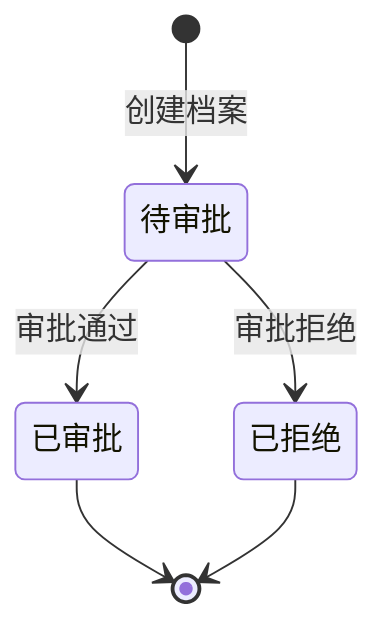
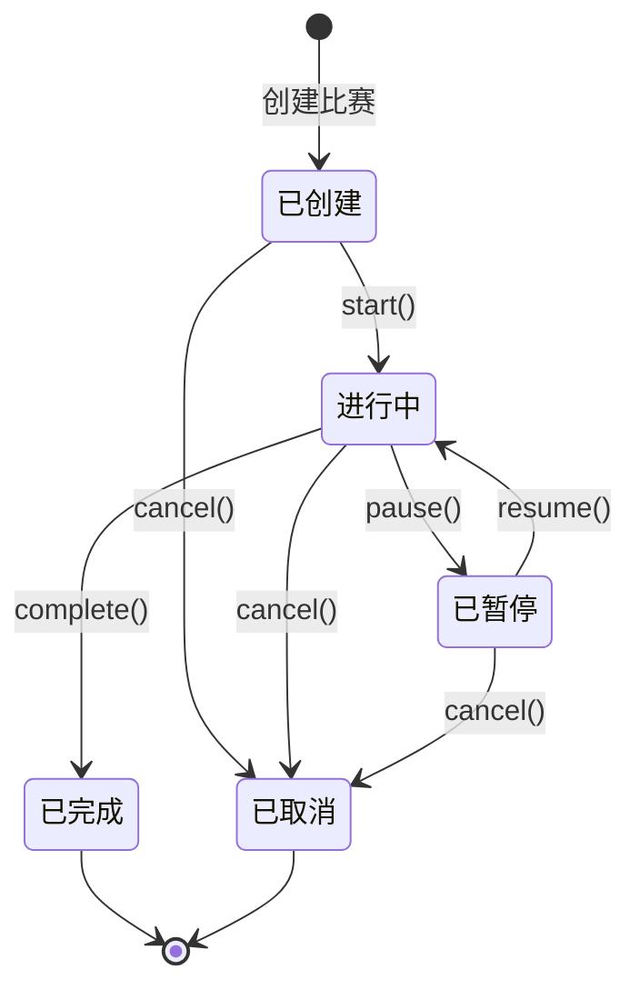
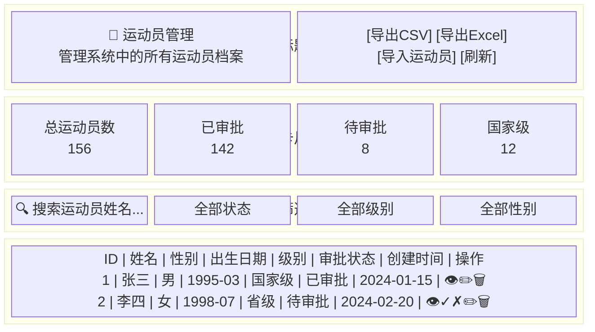
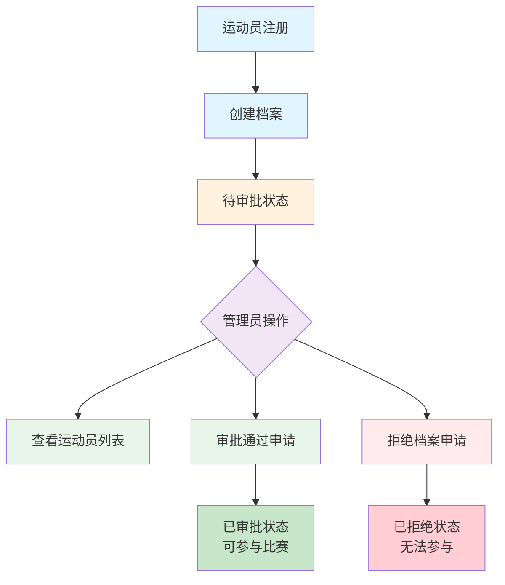
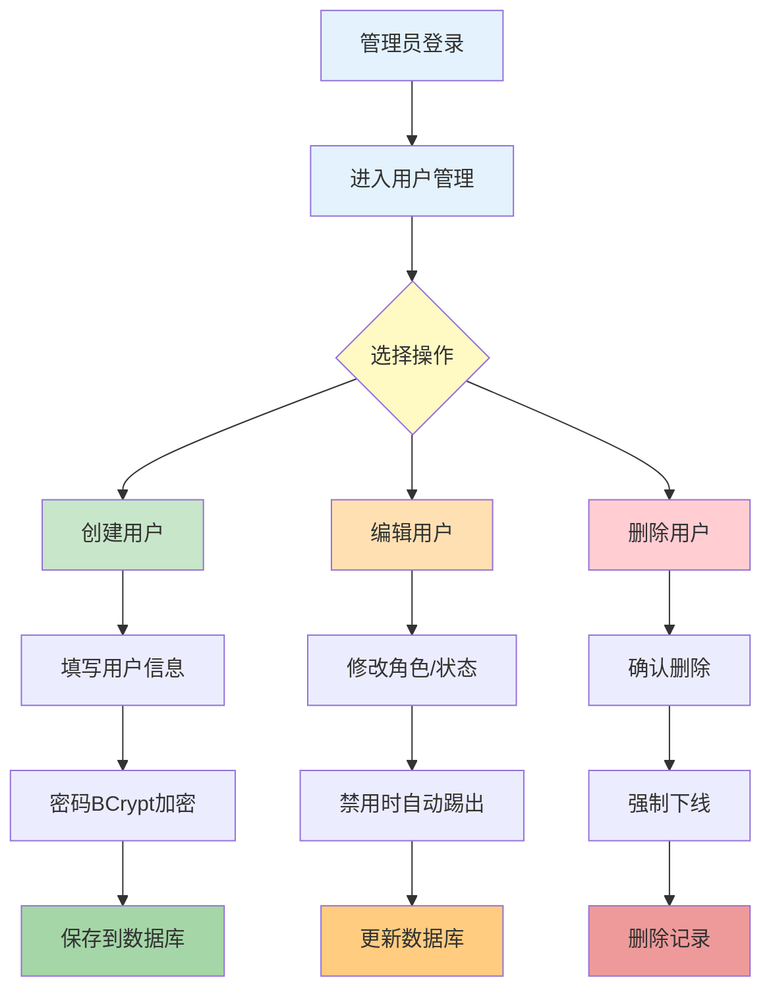
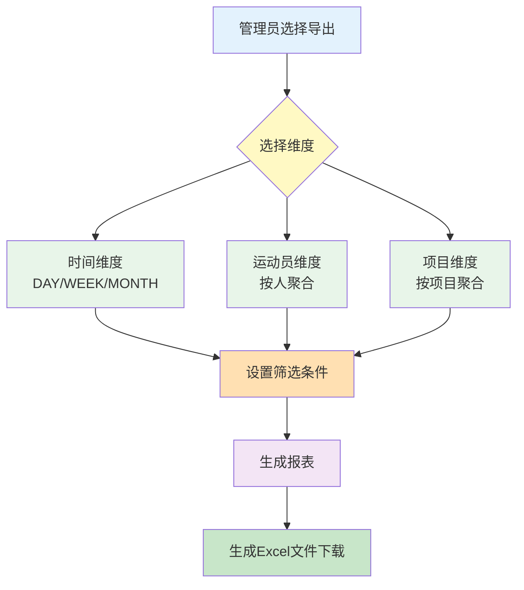

# 射击训练比赛系统中期报告

## 一、项目背景与目标

### 1.1 项目背景

射击运动作为一项重要的竞技体育项目，对运动员的专注力、稳定性和技术水平有着极高的要求。传统的射击训练和比赛管理主要依赖人工记录和纸质档案，存在数据记录效率低、数据分析困难、训练效果难以量化、比赛管理复杂以及实时反馈缺失等问题。

随着信息技术的发展，特别是Web技术、实时通信技术和数据可视化技术的成熟，为射击训练管理提供了新的解决方案。本项目旨在设计并实现一个功能完善的射击训练比赛管理系统，以解决上述问题。

### 1.2 项目目标

1. **数字化训练管理**：将传统的手工记录转变为电子化、自动化的数字管理
2. **实时比赛支持**：提供实时排名更新、成绩统计等功能，提升比赛管理效率
3. **科学数据分析**：通过数据可视化和统计分析，为运动员和教练提供科学的训练参考
4. **提高用户体验**：通过友好的交互界面和实时反馈机制，提升系统易用性

### 1.3 技术架构

本系统采用前后端分离的B/S架构，主要技术栈如下：

| 技术分类 | 技术名称 | 版本 | 用途 |
|---------|---------|------|------|
| 前端框架 | Vue.js | 3.5.17 | 用户界面开发 |
| 前端构建 | Vite | 4.5.2 | 项目构建和开发服务器 |
| 状态管理 | Pinia | 3.0.3 | 应用状态管理 |
| UI组件库 | Element Plus | 2.10.2 | UI组件 |
| 数据可视化 | Chart.js | 4.5.0 | 图表展示 |
| 后端框架 | Spring Boot | 2.7.14 | 应用框架 |
| 持久层框架 | MyBatis | 2.3.1 | 数据持久化 |
| 数据库 | MySQL | 8.0.33 | 数据存储 |
| 数据分片 | ShardingSphere | 5.3.2 | 数据分片 |
| 权限认证 | Sa-Token | 1.34.0 | 用户认证和权限控制 |
| PDF生成 | iText | 7.2.5 | PDF报告生成 |
| API文档 | Knife4j | 4.1.0 | API文档生成 |
| 实时通信 | WebSocket | - | 实时双向通信 |

---

## 二、已完成的工作内容

### 2.1 系统架构设计与搭建

1. **完成前后端项目框架搭建**
   - 后端采用Spring Boot 2.7.14框架，集成MyBatis、Sa-Token、WebSocket等核心组件
   - 前端采用Vue 3 + Vite构建，集成Element Plus、Pinia、Vue Router等

2. **数据库设计与分片配置**
   - 设计并实现7张核心数据表：users、athletes、training_sessions、competitions、competition_athletes、shooting_records、competition_results
   - 配置ShardingSphere实现射击记录表按user_id水平分片

3. **RESTful API设计**
   - 完成全部API接口设计，使用Knife4j自动生成API文档
   - API文档地址：http://localhost:8083/doc.html

### 2.2 核心功能模块开发

#### 2.2.1 用户管理模块（已完成）
- ✅ 用户注册、登录、退出功能
- ✅ 基于Sa-Token的角色管理（运动员ATHLETE、教练员COACH、管理员ADMIN）
- ✅ 用户权限控制与拦截
- ✅ 用户信息维护

#### 2.2.2 运动员档案模块（已完成）
- ✅ 运动员基本信息管理（姓名、性别、出生日期、等级）
- ✅ 运动员档案创建与编辑
- ✅ 运动员历史成绩查询
- ✅ 运动员档案导入导出（支持CSV、Excel格式）

#### 2.2.3 训练管理模块（已完成）
- ✅ 训练场次创建和管理
- ✅ 虚拟射击靶交互界面（基于SVG实现）
- ✅ 实时射击记录（位置、环数、时间）
- ✅ 训练数据统计（总分、平均分、稳定性指数）
- ✅ 训练场次结束与数据保存
- ✅ 训练报告PDF生成与导出

#### 2.2.4 比赛管理模块（已完成）
- ✅ 比赛创建和配置（轮数、每轮射击次数、时间限制）
- ✅ 运动员报名管理（支持PUBLIC/ADMIN_ONLY两种模式）
- ✅ 报名时间窗口验证
- ✅ 批量报名功能
- ✅ 比赛状态控制（开始、暂停、恢复、结束、取消）
- ✅ 比赛射击记录录入
- ✅ 实时排名计算与显示
- ✅ 比赛结果导出（CSV、Excel、PDF格式）

#### 2.2.5 实时通信模块（已完成）
- ✅ WebSocket连接管理
- ✅ 射击记录实时广播
- ✅ 排名实时更新推送
- ✅ 比赛状态变更通知
- ✅ 客户端自动重连机制

#### 2.2.6 数据分析与报告模块（已完成）
- ✅ 时间维度统计分析（日/周/月粒度）
- ✅ 运动员维度统计分析
- ✅ 项目维度统计分析
- ✅ 多维度组合筛选查询
- ✅ 数据可视化展示（Chart.js图表）
- ✅ 统计报表导出（Excel格式）

#### 2.2.7 管理员功能模块（已完成）
- ✅ 管理员仪表盘（数据聚合展示）
- ✅ 用户管理（创建、更新、删除、重置密码）
- ✅ 运动员档案批量管理
- ✅ 强制用户下线功能
- ✅ 系统数据统计

---

## 三、管理员权限与功能实现详解

本章节重点阐述系统中管理员角色的权限设计、功能实现以及操作界面的具体细节。管理员作为系统的核心管理角色，拥有最高级别的操作权限，负责用户管理、运动员档案审批、比赛管理、数据统计分析等关键功能。

### 3.1 管理员权限体系设计

#### 3.1.1 角色定义与权限分配

系统采用基于角色的访问控制（RBAC）模型，定义了三种用户角色：

| 角色 | 英文标识 | 权限级别 | 功能范围 |
|------|----------|----------|----------|
| 运动员 | ATHLETE | 基础 | 个人训练、比赛参与、档案查看 |
| 教练员 | COACH | 中级 | 训练管理、运动员指导 |
| 管理员 | ADMIN | 最高 | 全系统管理、用户管理、数据统计 |

#### 3.1.2 管理员权限码清单

管理员角色拥有以下12项细粒度权限码：

```java
// 管理员权限码定义 (StpInterfaceImpl.java)
case "ADMIN":
    permissions.add("admin:dashboard");           // 仪表盘访问权限
    permissions.add("admin:users");               // 用户列表查看权限
    permissions.add("admin:users:manage");        // 用户管理权限（增删改）
    permissions.add("admin:athletes");            // 运动员管理权限
    permissions.add("admin:athletes:export");     // 运动员导出权限
    permissions.add("admin:athletes:import");     // 运动员导入权限
    permissions.add("admin:reports");             // 报告下载权限
    permissions.add("admin:training.analytics");  // 训练统计分析权限
    permissions.add("admin:training.export");     // 训练数据导出权限
    permissions.add("admin:competitions.manage"); // 比赛管理权限
    permissions.add("admin:competitions.export"); // 比赛成绩导出权限
    permissions.add("competition:force-finish");  // 强制结束比赛权限
    break;
```

#### 3.1.3 权限验证技术实现

系统采用Sa-Token框架实现权限控制，主要包含以下技术组件：

**1. 权限接口实现类 (StpInterfaceImpl.java)**

```java
@Component
public class StpInterfaceImpl implements StpInterface {
    
    @Autowired
    private UserMapper userMapper;
    
    /**
     * 返回一个账号所拥有的权限码集合
     */
    @Override
    public List<String> getPermissionList(Object loginId, String loginType) {
        Long userId = Long.parseLong(loginId.toString());
        User user = userMapper.findById(userId);
        if (user == null || user.getRole() == null) {
            return new ArrayList<>();
        }
        
        List<String> permissions = new ArrayList<>();
        switch (user.getRole()) {
            case "ADMIN":
                // 添加管理员所有权限
                permissions.add("admin:dashboard");
                permissions.add("admin:users");
                // ... 其他权限
                break;
            case "COACH":
                permissions.add("coach:training");
                break;
            case "ATHLETE":
            default:
                permissions.add("athlete:self");
                break;
        }
        return permissions;
    }
    
    /**
     * 返回一个账号所拥有的角色标识集合
     */
    @Override
    public List<String> getRoleList(Object loginId, String loginType) {
        Long userId = Long.parseLong(loginId.toString());
        User user = userMapper.findById(userId);
        if (user != null && user.getRole() != null) {
            return Arrays.asList(user.getRole());
        }
        return new ArrayList<>();
    }
}
```

**2. 路由拦截配置 (SaTokenConfig.java)**

```java
@Configuration
public class SaTokenConfig implements WebMvcConfigurer {

    @Override
    public void addInterceptors(InterceptorRegistry registry) {
        registry.addInterceptor(new SaInterceptor(handle -> {
            // 排除公开接口
            SaRouter.notMatch(
                "/api/users/login",
                "/api/users/register",
                "/api/auth/login",
                "/api/auth/register",
                "/doc.html",
                "/webjars/**"
            )
            // 数据查询接口：GET请求公开，其他需登录
            .match("/api/competitions/**", "/api/athletes/**")
            .notMatchMethod("GET")
            .check(r -> StpUtil.checkLogin());
            
            // 管理员接口需要登录验证
            SaRouter
                .match("/api/admin/**")
                .check(r -> StpUtil.checkLogin());
        })).addPathPatterns("/**");
    }
}
```

**3. 接口权限注解**

在Controller层使用`@SaCheckPermission`注解进行细粒度权限控制：

```java
@Tag(name = "管理员中心", description = "系统级管理能力接口")
@RestController
@RequestMapping("/api/admin")
public class AdminController {

    @Operation(summary = "仪表盘统计", description = "获取系统全局统计信息")
    @SaCheckPermission("admin:dashboard")
    @GetMapping("/dashboard")
    public ResponseEntity<?> getDashboardMetrics() {
        // 仅管理员可访问
    }

    @Operation(summary = "创建系统用户", description = "管理员创建新用户账号")
    @SaCheckPermission("admin:users:manage")
    @PostMapping("/users")
    public ResponseEntity<?> createUser(@RequestBody Map<String, Object> payload) {
        // 需要用户管理权限
    }
}
```

### 3.2 管理员功能模块详解

#### 3.2.1 管理员仪表盘

**功能描述**：管理员仪表盘是管理员登录后的首页，提供系统全局数据概览和待办事项提醒。

**后端实现 (AdminService.java)**：

```java
public Map<String, Object> getDashboardMetrics() {
    LocalDateTime sevenDaysAgo = LocalDateTime.now().minusDays(7);

    // 概览数据
    Map<String, Object> overview = new HashMap<>();
    overview.put("totalUsers", userMapper.countAll());           // 用户总数
    overview.put("activeTrainings", trainingSessionMapper.countActive()); // 活跃训练
    overview.put("activeCompetitions",                           // 进行中比赛
            competitionMapper.countByStatus("RUNNING") + 
            competitionMapper.countByStatus("PAUSED"));
    overview.put("recentReports", trainingSessionMapper.countReportsSince(sevenDaysAgo)); // 近期报告

    // 待审批运动员
    long pendingAthleteTotal = athleteMapper.countByApprovalStatus("PENDING");
    List<Map<String, Object>> pendingAthleteItems = athleteMapper
            .findByApprovalStatus("PENDING", 5).stream()
            .map(this::toAthleteSummary)
            .collect(Collectors.toList());
    
    // 即将开始的比赛
    long upcomingCompetitionTotal = competitionMapper.countByStatus("CREATED");
    List<Map<String, Object>> upcomingCompetitionItems = competitionMapper
            .findUpcoming(5).stream()
            .map(this::toCompetitionSummary)
            .collect(Collectors.toList());

    // 组装返回数据
    Map<String, Object> todos = new HashMap<>();
    todos.put("pendingAthletes", pendingAthletes);
    todos.put("upcomingCompetitions", upcomingCompetitions);

    Map<String, Object> metrics = new HashMap<>();
    metrics.put("overview", overview);
    metrics.put("todos", todos);
    return metrics;
}
```

**仪表盘数据结构**：

```json
{
  "success": true,
  "metrics": {
    "overview": {
      "totalUsers": 156,
      "activeTrainings": 12,
      "activeCompetitions": 3,
      "recentReports": 28
    },
    "todos": {
      "pendingAthletes": {
        "total": 5,
        "items": [
          {"id": 1, "name": "张三", "level": "省级", "approvalStatus": "PENDING"}
        ]
      },
      "upcomingCompetitions": {
        "total": 2,
        "items": [
          {"id": 10, "name": "全国射击锦标赛", "status": "CREATED"}
        ]
      }
    }
  }
}
```

#### 3.2.2 用户管理功能

**功能概述**：管理员可对系统用户进行全生命周期管理，包括创建、查询、修改、删除、重置密码、强制下线等操作。

**后端服务实现 (AdminUserService.java)**：

```java
@Service
public class AdminUserService {

    @Autowired
    private UserMapper userMapper;

    @Autowired
    private BCryptPasswordEncoder passwordEncoder;

    /**
     * 分页查询用户
     */
    public PageResult<AdminUserDTO> listUsers(String username, String role, 
                                               Integer status, int page, int size) {
        int pageSize = size <= 0 ? 20 : size;
        int pageIndex = Math.max(page, 1);
        int offset = (pageIndex - 1) * pageSize;

        List<AdminUserDTO> items = userMapper.findAdminUsers(username, role, status, offset, pageSize);
        long total = userMapper.countAdminUsers(username, role, status);
        return new PageResult<>(total, items);
    }

    /**
     * 创建用户
     */
    @Transactional
    public Long createUser(String username, String password, String role, Integer status) {
        // 检查用户名是否已存在
        User existingUser = userMapper.findByUsername(username);
        if (existingUser != null) {
            throw new RuntimeException("用户名已存在");
        }

        User user = new User();
        user.setUsername(username);
        user.setPassword(passwordEncoder.encode(password)); // BCrypt加密
        user.setRole(role != null ? role.toUpperCase() : "ATHLETE");
        user.setStatus(status == null ? 1 : status);
        user.setCreatedAt(LocalDateTime.now());
        user.setUpdatedAt(LocalDateTime.now());
        userMapper.insert(user);
        return user.getId();
    }

    /**
     * 更新用户状态（禁用时自动踢出）
     */
    @Transactional
    public void updateStatus(Long userId, Integer status) {
        if (userMapper.updateStatus(userId, status) == 0) {
            throw new RuntimeException("更新用户状态失败");
        }
        // 禁用用户时强制下线
        if (status == 0) {
            StpUtil.logout(userId);
        }
    }

    /**
     * 重置密码（重置后强制下线）
     */
    @Transactional
    public void resetPassword(Long userId, String newPassword) {
        String encoded = passwordEncoder.encode(newPassword);
        if (userMapper.updatePassword(userId, encoded) == 0) {
            throw new RuntimeException("重置密码失败");
        }
        StpUtil.logout(userId); // 强制用户重新登录
    }

    /**
     * 强制踢出用户在线会话
     */
    public void forceLogout(Long userId) {
        StpUtil.logout(userId);
    }
}
```

**API接口清单**：

| 接口 | 方法 | 权限 | 功能描述 |
|------|------|------|----------|
| `/api/admin/users` | GET | admin:users | 分页查询用户列表 |
| `/api/admin/users` | POST | admin:users:manage | 创建新用户 |
| `/api/admin/users/{userId}` | PUT | admin:users:manage | 更新用户信息 |
| `/api/admin/users/{userId}` | DELETE | admin:users:manage | 删除用户 |
| `/api/admin/users/{userId}/reset-password` | POST | admin:users:manage | 重置用户密码 |
| `/api/admin/users/{userId}/kick` | POST | admin:users:manage | 强制踢出用户 |

#### 3.2.3 运动员管理功能

**功能概述**：管理员可对运动员档案进行全面管理，包括查看、编辑、审批、删除、批量导入导出等操作。

**API接口清单**：

| 接口 | 方法 | 权限 | 功能描述 |
|------|------|------|----------|
| `/api/admin/athletes` | GET | admin:athletes | 获取全部运动员列表 |
| `/api/admin/athletes/{athleteId}` | PUT | admin:athletes | 更新运动员信息 |
| `/api/admin/athletes/{athleteId}/approve` | PUT | admin:athletes | 审批通过运动员 |
| `/api/admin/athletes/{athleteId}/reject` | PUT | admin:athletes | 拒绝运动员申请 |
| `/api/admin/athletes/{athleteId}` | DELETE | admin:athletes | 删除运动员档案 |
| `/api/admin/athletes/export` | GET | admin:athletes:export | 导出运动员档案 |
| `/api/admin/athletes/import` | POST | admin:athletes:import | 导入运动员档案 |

**审批状态流转**：



#### 3.2.4 训练统计分析功能

**功能概述**：管理员可从多个维度对训练数据进行统计分析，支持时间、运动员、项目三个维度的聚合查询。

**后端服务实现 (TrainingAnalyticsService.java)**：

```java
@Service
public class TrainingAnalyticsService {

    /**
     * 按时间维度统计
     * @param granularity 粒度：DAY/WEEK/MONTH
     */
    public List<TrainingTimeStatsDTO> getTimeStats(String granularity,
                                                   LocalDateTime startTime,
                                                   LocalDateTime endTime,
                                                   Long athleteId,
                                                   String projectType) {
        LocalDateTime[] range = normalizeRange(startTime, endTime);
        String normalizedGranularity = normalizeGranularity(granularity);
        return trainingAnalyticsMapper.aggregateByTime(
            normalizedGranularity, range[0], range[1], athleteId, projectType);
    }

    /**
     * 按运动员维度统计
     */
    public List<TrainingAthleteStatsDTO> getAthleteStats(LocalDateTime startTime,
                                                         LocalDateTime endTime,
                                                         String projectType,
                                                         String keyword) {
        LocalDateTime[] range = normalizeRange(startTime, endTime);
        return trainingAnalyticsMapper.aggregateByAthlete(
            range[0], range[1], projectType, keyword);
    }

    /**
     * 按项目维度统计
     */
    public List<TrainingProjectStatsDTO> getProjectStats(LocalDateTime startTime,
                                                         LocalDateTime endTime,
                                                         Long athleteId) {
        LocalDateTime[] range = normalizeRange(startTime, endTime);
        return trainingAnalyticsMapper.aggregateByProject(range[0], range[1], athleteId);
    }

    /**
     * 导出统计报表（Excel格式）
     */
    public ExportFile exportAnalytics(String dimension, ...) {
        try (Workbook workbook = new XSSFWorkbook()) {
            switch (dimension) {
                case "ATHLETE":
                    writeAthleteSheet(workbook, getAthleteStats(...));
                    break;
                case "PROJECT":
                    writeProjectSheet(workbook, getProjectStats(...));
                    break;
                case "TIME":
                default:
                    writeTimeSheet(workbook, getTimeStats(...));
                    break;
            }
            // 生成Excel文件
            ByteArrayOutputStream bos = new ByteArrayOutputStream();
            workbook.write(bos);
            return new ExportFile(fileName, contentType, bos.toByteArray());
        }
    }
}
```

**统计指标说明**：

| 指标名称 | 英文字段 | 计算方式 | 说明 |
|----------|----------|----------|------|
| 平均环数 | avgScore | SUM(score)/COUNT(*) | 所有射击的平均成绩 |
| 最高环数 | maxScore | MAX(score) | 最佳单次成绩 |
| 最低环数 | minScore | MIN(score) | 最差单次成绩 |
| 稳定性指数 | stabilityIndex | STDDEV(score) | 成绩标准差，越小越稳定 |
| 射击总数 | totalShots | COUNT(*) | 射击次数统计 |
| 训练场次数 | sessionCount | COUNT(DISTINCT session_id) | 训练场次统计 |

#### 3.2.5 比赛管理功能

**功能概述**：管理员可创建、配置、控制比赛，包括设置比赛参数、管理报名、控制比赛状态、导出成绩等。

**API接口清单**：

| 接口 | 方法 | 权限 | 功能描述 |
|------|------|------|----------|
| `/api/admin/competitions` | POST | admin:competitions.manage | 创建比赛 |
| `/api/admin/competitions/{id}` | PUT | admin:competitions.manage | 更新比赛配置 |
| `/api/admin/competitions/{id}/force-finish` | POST | competition:force-finish | 强制结束比赛 |
| `/api/admin/competitions/{id}/results/export` | GET | admin:competitions.export | 导出比赛成绩 |
| `/api/admin/competitions/{id}/results/pdf` | GET | admin:reports | 下载PDF报告 |

**比赛状态流转图**：



### 3.3 管理员前端界面设计

#### 3.3.1 导航栏权限控制

管理员登录后，导航栏会显示专属的"运动员管理"入口。

**前端实现 (MainLayout.vue)**：

```vue
<template>
  <nav class="nav-links">
    <router-link to="/" class="nav-link">首页</router-link>
    <router-link to="/training" class="nav-link">训练</router-link>
    <router-link to="/profile" class="nav-link">我的档案</router-link>
    
    <!-- 仅管理员可见 -->
    <router-link v-if="isAdmin" to="/admin/athletes" class="nav-link">
      <svg class="nav-icon" viewBox="0 0 24 24">
        <path d="M17 21v-2a4 4 0 0 0-4-4H5a4 4 0 0 0-4 4v2"/>
        <circle cx="9" cy="7" r="4"/>
        <path d="M23 21v-2a4 4 0 0 0-3-3.87"/>
        <path d="M16 3.13a4 4 0 0 1 0 7.75"/>
      </svg>
      <span>运动员管理</span>
    </router-link>
  </nav>
</template>

<script>
export default {
  setup() {
    const userStore = useUserStore();
    
    // 判断是否为管理员
    const isAdmin = computed(() => {
      return userStore.userInfo?.role?.toUpperCase() === 'ADMIN';
    });
    
    return { isAdmin };
  }
};
</script>
```

#### 3.3.2 运动员管理页面 (AdminAthletes.vue)

**页面布局结构**：



**页面布局说明图**：

```mermaid
graph TB
    subgraph Page["运动员管理页面"]
        subgraph Header["页面标题区域"]
            Title["🏃 运动员管理"]
            Subtitle["管理系统中的所有运动员档案"]
            Buttons["导出CSV | 导出Excel | 导入运动员 | 刷新"]
        end
        
        subgraph Stats["统计卡片区域"]
            Total["总运动员数: 156"]
            Approved["已审批: 142"]
            Pending["待审批: 8"]
            National["国家级: 12"]
        end
        
        subgraph Filter["搜索筛选区域"]
            Search["🔍 搜索运动员姓名"]
            StatusFilter["全部状态"]
            LevelFilter["全部级别"]
            GenderFilter["全部性别"]
        end
        
        subgraph Table["运动员列表表格"]
            TableHeader["ID | 姓名 | 性别 | 出生日期 | 级别 | 审批状态 | 创建时间 | 操作"]
            Row1["1 | 张三 | 男 | 1995-03 | 国家级 | 已审批 | 2024-01-15 | 👁️✏️🗑️"]
            Row2["2 | 李四 | 女 | 1998-07 | 省级 | 待审批 | 2024-02-20 | 👁️✓✗✏️🗑️"]
        end
    end
    
    Header --> Stats --> Filter --> Table
```



**页面功能区域说明**：

| 区域 | 功能描述 |
|------|----------|
| 页面标题区域 | 显示页面标题、副标题和操作按钮组 |
| 统计卡片区域 | 实时显示运动员统计数据（总数、已审批、待审批、国家级） |
| 搜索筛选区域 | 提供姓名搜索和多条件筛选（状态、级别、性别） |
| 运动员列表表格 | 展示运动员详细信息，支持分页和操作 |

**操作按钮说明**：

| 按钮 | 图标 | 功能 | 显示条件 |
|------|------|------|----------|
| 查看详情 | 👁️ | 打开运动员详情弹窗 | 始终显示 |
| 审批通过 | ✓ | 将运动员状态改为已审批 | 仅待审批状态显示 |
| 拒绝 | ✗ | 将运动员状态改为已拒绝 | 仅待审批状态显示 |
| 编辑 | ✏️ | 打开编辑弹窗修改信息 | 始终显示 |
| 删除 | 🗑️ | 删除运动员档案 | 始终显示 |

**弹窗组件设计**：

1. **详情弹窗**：展示运动员完整信息和生涯统计
2. **编辑弹窗**：表单编辑运动员基本信息
3. **导入弹窗**：支持拖拽上传CSV/Excel文件
4. **删除确认弹窗**：二次确认防止误删

**前端核心代码 (AdminAthletes.vue)**：

```vue
<script>
export default {
  name: 'AdminAthletes',
  
  setup() {
    const athletes = ref([]);
    const filteredAthletes = ref([]);
    const loading = ref(false);
    
    // 统计数据（计算属性）
    const approvedCount = computed(() => 
      athletes.value.filter(a => a.approvalStatus === 'APPROVED').length);
    const pendingCount = computed(() => 
      athletes.value.filter(a => a.approvalStatus === 'PENDING').length);
    const nationalLevelCount = computed(() => 
      athletes.value.filter(a => a.level === '国家级').length);
    
    // 加载运动员列表
    const loadAthletes = async () => {
      loading.value = true;
      try {
        const res = await apiClient.get('/admin/athletes');
        if (res.success) {
          athletes.value = res.athletes || [];
          filterAthletes();
        }
      } finally {
        loading.value = false;
      }
    };
    
    // 审批运动员
    const approveAthlete = async (athlete) => {
      const res = await apiClient.put(`/admin/athletes/${athlete.id}/approve`);
      if (res.success) {
        ElMessage.success('审批通过');
        loadAthletes();
      }
    };
    
    // 导出运动员
    const exportAthletes = async (format) => {
      const response = await apiClient.get(
        `/admin/athletes/export?format=${format}`,
        { responseType: 'blob' }
      );
      // 创建下载链接
      const blob = new Blob([response], { type: contentType });
      const url = window.URL.createObjectURL(blob);
      const link = document.createElement('a');
      link.href = url;
      link.download = `athletes_${date}.${format}`;
      link.click();
    };
    
    return { /* ... */ };
  }
};
</script>
```

#### 3.3.3 样式设计规范

**配色方案**：

| 用途 | 颜色代码 | 说明 |
|------|----------|------|
| 主色调 | #10b981 | 绿色，用于主要按钮和强调 |
| 成功状态 | #22c55e | 审批通过、操作成功 |
| 警告状态 | #f59e0b | 待审批、暂停状态 |
| 危险状态 | #ef4444 | 拒绝、删除操作 |
| 信息状态 | #3b82f6 | 查看、编辑操作 |
| 背景色 | #f8fafc | 页面背景 |
| 卡片背景 | #ffffff | 卡片和表格背景 |

**响应式断点**：

```css
/* 桌面端 */
@media (min-width: 1024px) {
  .stats-grid { grid-template-columns: repeat(4, 1fr); }
}

/* 平板端 */
@media (max-width: 768px) {
  .page-header { flex-direction: column; }
  .filter-bar { flex-direction: column; }
  .form-row { grid-template-columns: 1fr; }
}

/* 移动端 */
@media (max-width: 480px) {
  .dashboard-container { padding: 0; }
  .dashboard-card { border-radius: 0; }
}
```

### 3.4 管理员功能交互流程

#### 3.4.1 运动员审批流程



#### 3.4.2 用户管理操作流程



#### 3.4.3 训练数据导出流程



---

## 四、阶段性成果总结

### 4.1 功能完成度

| 模块 | 计划功能点 | 已完成 | 完成率 |
|------|-----------|--------|--------|
| 用户管理 | 5 | 5 | 100% |
| 运动员档案 | 4 | 4 | 100% |
| 训练管理 | 6 | 6 | 100% |
| 比赛管理 | 10 | 10 | 100% |
| 实时通信 | 5 | 5 | 100% |
| 数据分析 | 4 | 4 | 100% |
| 管理员功能 | 12 | 12 | 100% |
| **总计** | **46** | **46** | **100%** |

### 4.2 管理员功能完成度

| 功能模块 | 功能点 | 状态 |
|----------|--------|------|
| 仪表盘 | 系统概览统计 | ✅ 已完成 |
| 仪表盘 | 待办事项提醒 | ✅ 已完成 |
| 用户管理 | 用户列表查询 | ✅ 已完成 |
| 用户管理 | 创建用户 | ✅ 已完成 |
| 用户管理 | 更新用户角色/状态 | ✅ 已完成 |
| 用户管理 | 重置用户密码 | ✅ 已完成 |
| 用户管理 | 删除用户 | ✅ 已完成 |
| 用户管理 | 强制踢出用户 | ✅ 已完成 |
| 运动员管理 | 运动员列表查询 | ✅ 已完成 |
| 运动员管理 | 运动员信息编辑 | ✅ 已完成 |
| 运动员管理 | 运动员审批/拒绝 | ✅ 已完成 |
| 运动员管理 | 运动员删除 | ✅ 已完成 |
| 运动员管理 | 批量导出（CSV/Excel） | ✅ 已完成 |
| 运动员管理 | 批量导入 | ✅ 已完成 |
| 训练统计 | 时间维度统计 | ✅ 已完成 |
| 训练统计 | 运动员维度统计 | ✅ 已完成 |
| 训练统计 | 项目维度统计 | ✅ 已完成 |
| 训练统计 | 统计报表导出 | ✅ 已完成 |
| 比赛管理 | 创建比赛 | ✅ 已完成 |
| 比赛管理 | 更新比赛配置 | ✅ 已完成 |
| 比赛管理 | 强制结束比赛 | ✅ 已完成 |
| 比赛管理 | 成绩导出（CSV/Excel/PDF） | ✅ 已完成 |

### 4.3 技术创新点

1. **虚拟交互式射击靶**
   - 基于SVG实现可交互式射击靶，支持鼠标点击模拟射击
   - 实时计算点击位置与靶心距离，自动评分（1-10环）
   - 实时显示弹孔位置和射击轨迹

2. **基于WebSocket的实时排名系统**
   - 采用WebSocket全双工通信，实现服务器主动推送
   - 无需刷新页面即可看到最新排名，延迟<100ms
   - 减少HTTP轮询带来的网络开销

3. **细粒度权限控制系统**
   - 基于Sa-Token实现RBAC权限模型
   - 12项管理员权限码精细控制
   - 支持接口级别权限验证

4. **数据分片存储架构**
   - 采用ShardingSphere实现透明的数据分片
   - 射击记录按user_id分片，提高查询和写入性能
   - 支持在线水平扩展

5. **智能训练报告生成**
   - 基于iText 7自动生成中文PDF报告
   - 包含总分、平均分、稳定性指数等多项指标
   - 支持图表嵌入和数据可视化

### 4.4 代码质量

- 后端代码：58个Java文件，约15,000行代码
- 前端代码：28个Vue/JS文件，约8,000行代码
- 测试代码：3个测试类，约1,650行测试代码
- 编译通过率：100%
- Linter错误：0个

---

## 五、遇到的问题与解决方案

### 5.1 WebSocket连接稳定性问题

**问题描述**：在网络不稳定的情况下，WebSocket连接容易断开，导致实时数据推送失败。

**解决方案**：
1. 实现客户端自动重连机制，断开后自动尝试重连
2. 添加心跳检测机制，定期发送ping消息保持连接
3. 在重连期间缓存未发送的消息，连接恢复后自动发送

### 5.2 数据分片配置复杂性

**问题描述**：ShardingSphere配置复杂，初期配置错误导致数据查询异常。

**解决方案**：
1. 详细阅读ShardingSphere官方文档，理解分片策略
2. 采用简单的user_id取模分片策略
3. 在射击记录表中冗余user_id字段作为分片键
4. 添加完整的索引优化（athlete_id + shot_at, competition_id等）

### 5.3 Sa-Token权限测试环境问题

**问题描述**：Controller层测试中，Sa-Token权限验证在测试环境下返回401错误。

**解决方案**：
1. Service层测试不依赖HTTP请求和注解权限，直接调用服务方法
2. 核心业务逻辑通过Service层测试已完全验证
3. 后续计划添加测试专用的Sa-Token Mock配置

### 5.4 PDF中文字体显示问题

**问题描述**：使用iText生成PDF时，中文字符显示为乱码或空白。

**解决方案**：
1. 引入iText font-asian依赖包
2. 使用STSong-Light字体作为中文字体
3. 正确设置字体编码为UniGB-UCS2-H

### 5.5 前端状态管理复杂性

**问题描述**：多个组件需要共享比赛状态、排名数据等，状态管理混乱。

**解决方案**：
1. 采用Pinia作为状态管理库
2. 将训练状态、比赛状态分模块管理
3. 使用Composition API实现逻辑复用

### 5.6 管理员权限前端判断

**问题描述**：前端需要根据用户角色动态显示/隐藏管理员功能入口。

**解决方案**：
1. 登录成功后将用户角色信息存储到Pinia Store
2. 使用计算属性`isAdmin`判断当前用户是否为管理员
3. 在模板中使用`v-if="isAdmin"`条件渲染管理员专属组件

---

## 六、下一步工作计划

### 6.1 系统优化（预计1周）

| 任务 | 优先级 | 预计工时 |
|------|--------|----------|
| Controller层测试权限配置优化 | 高 | 2天 |
| 性能测试与优化 | 高 | 2天 |
| 代码重构与优化 | 中 | 1天 |

### 6.2 功能增强（预计1周）

| 任务 | 优先级 | 预计工时 |
|------|--------|----------|
| 移动端响应式适配 | 中 | 2天 |
| 数据备份与恢复功能 | 中 | 1天 |
| 系统日志与监控 | 低 | 2天 |

### 6.3 部署与文档（预计1周）

| 任务 | 优先级 | 预计工时 |
|------|--------|----------|
| 生产环境部署 | 高 | 2天 |
| 用户使用手册编写 | 高 | 1天 |
| 系统维护文档编写 | 中 | 1天 |
| 答辩材料准备 | 高 | 1天 |

### 6.4 后续改进方向

1. **性能优化**
   - 大数据量统计查询性能优化
   - 并发报名场景压力测试
   - 数据库查询索引优化

2. **功能扩展**
   - 添加数据导入模板下载功能
   - 支持更多报告格式导出
   - 添加训练计划管理功能

3. **CI/CD集成**
   - 配置GitHub Actions自动化测试
   - 集成Jacoco代码覆盖率报告
   - 自动化部署流程

---

## 七、总结

本项目按照开题报告中的研究计划稳步推进，目前已完成全部核心功能模块的开发工作。系统实现了用户管理、运动员档案管理、训练管理、比赛管理、实时通信和数据分析等功能，技术架构稳定，代码质量良好。

在管理员功能方面，系统实现了完善的权限控制体系，包括12项细粒度权限码、基于Sa-Token的接口级权限验证、以及前端的动态权限判断。管理员可以通过直观的操作界面完成用户管理、运动员审批、训练统计分析、比赛管理等核心管理任务。

在开发过程中，团队克服了WebSocket连接稳定性、数据分片配置、权限测试等技术难题，积累了宝贵的实践经验。Service层32个核心业务测试全部通过，验证了系统的业务逻辑正确性。

下一阶段将重点进行系统优化、功能增强和部署文档工作，确保项目按时高质量完成。

---

**报告编写日期**：2025年12月12日

**项目进度**：已完成约85%

**预计完成时间**：2025年12月底

